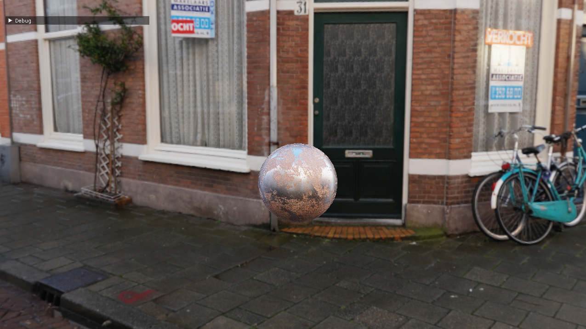
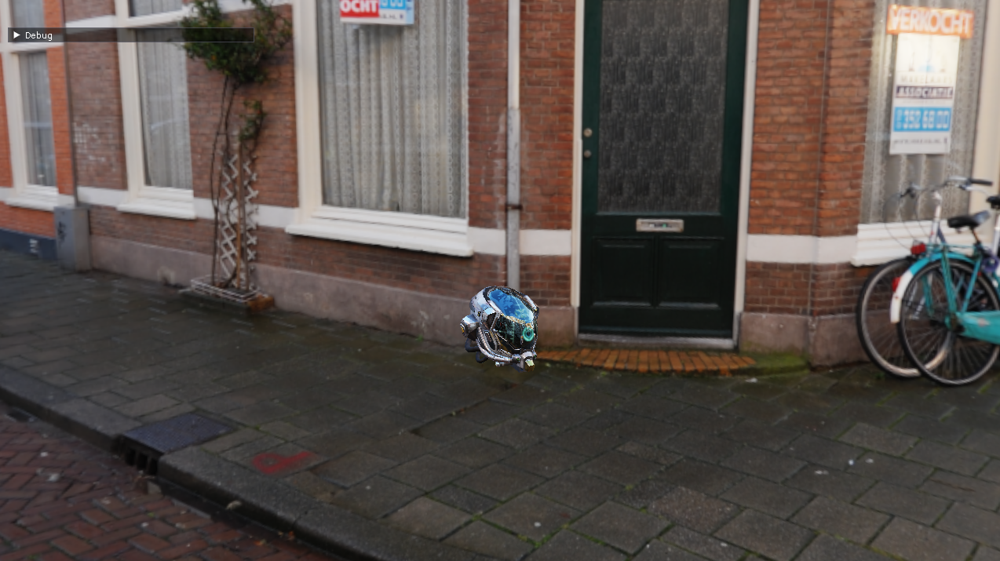

# Requirements
Direct3D12 capable hardware and OS (Windows 10 20H2 or newer) 
Windows 10 SDK or newer 
CMake 3.22 or newer (can use Visual Studio, VSCode or any other CMake supported IDE) 
DirectX Raytracing capable GPU and compatible drivers 

# Features
- Deferred Rendering
- Physically Based shading
- Image Based Lighting
- Cook-Torrance specular BRDF (w/ lambert diffuse)
- Gamma Correction and Tonemapping

# Showcase
### PBR+IBL

### Textured PBR+IBL

### Damaged Helmet PBR+IBL

### Cerberus PBR+IBL

### Gamma Correction and ACES Tonemap
| With | Without  |
|------|------|
|||

# Resources
[Real Shading in Unreal Engine 4](https://blog.selfshadow.com/publications/s2013-shading-course/karis/s2013_pbs_epic_notes_v2.pdf) 
[LearnOpenGL-PBR](https://learnopengl.com/PBR/Theory) 
[PBR by Michał Siejak](https://github.com/Nadrin/PBR)

# Third-Party
[gfx by Guillaume Boissé](https://github.com/gboisse/gfx)
